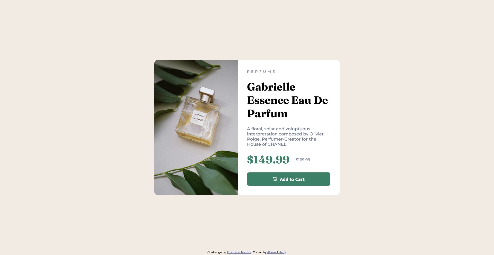

# Frontend Mentor - Product preview card component solution

This is a solution to the [Product preview card component challenge on Frontend Mentor](https://www.frontendmentor.io/challenges/product-preview-card-component-GO7UmttRfa). Frontend Mentor challenges help you improve your coding skills by building realistic projects.

## Table of contents

- [Overview](#overview)
  - [Screenshot](#screenshot)
  - [Links](#links)
- [My process](#my-process)
  - [Built with](#built-with)
  - [Useful resources](#useful-resources)
- [Author](#author)

## Overview

### Screenshot

### Links

- [Solution URL](https://github.com/ahmedhanyh/product-preview-card-component)
- [Live Site URL](https://ahmedhanyh.github.io/product-preview-card-component/)

## My process

### Built with

- Semantic HTML5 markup
- CSS custom properties
- BEM class naming methodology
- Flexbox

### Useful resources

- [The Odin Project's Responsive Images lesson](https://www.theodinproject.com/lessons/node-path-advanced-html-and-css-responsive-images) - This resource has a great explanation and it combines the best articles for making images responsive, specifically the [MDN article](https://developer.mozilla.org/en-US/docs/Learn/HTML/Multimedia_and_embedding/Responsive_images) from which I learned about the `<picture>` element that I've used to switch the image depending on screen size.

## Author

- GitHub - [@ahmedhanyh](https://github.com/ahmedhanyh)
- Frontend Mentor - [@ahmedhanyh](https://www.frontendmentor.io/profile/ahmedhanyh)
